# MySpa Social Backend 

Backend para WhatsApp. Está pensado para correr en **CloudFlare Workers** como servicio Node (siempre encendido).

## 1 - Qué tiene que haber en el repo de Github(carpeta `Chat/`)

- `server.js`
- `package.json`
- `README.md` (esto)
- `worker.js` (el archivo que reemplazas en CloudFlare)

## 2 - App en Facebook Developers para conectar WhatsApp, Facebook e Instagram

**2.a** - Primero debes crear una **FanPage** en **Facebook** sobre el negocio y agregar datos sobre el mismo. Tambien conectar con una cuenta de **Instagram**. Esto es necesario para crear el **Portfolio Comercial** y podeer acceder a la API de Facebook, Instagram y Whatsapp

**2.b** - Entra y haz login con tu cuenta de Facebook o crea una cuenta de desarrollador y crea una App en https://developers.facebook.com/ 

Aqui un video Ejemplo de Youtube:  https://www.youtube.com/watch?v=lnHaENblJJA

## 3 - En CloudFlare Workers Creas una cuenta gratuita [-> Cloudflare <-](https://dash.cloudflare.com/sign-up) - (Opcional, puede ser otro servidor)

Estando en el **Dashboard** de CloudFlare, selecciona en **Add** / **Workers** y luego **Create a Worker**.

  

En las siguientes opciones, selecciona **Conect Github** y realizamos la conexión con la cuenta y el repositorio de **Github**

  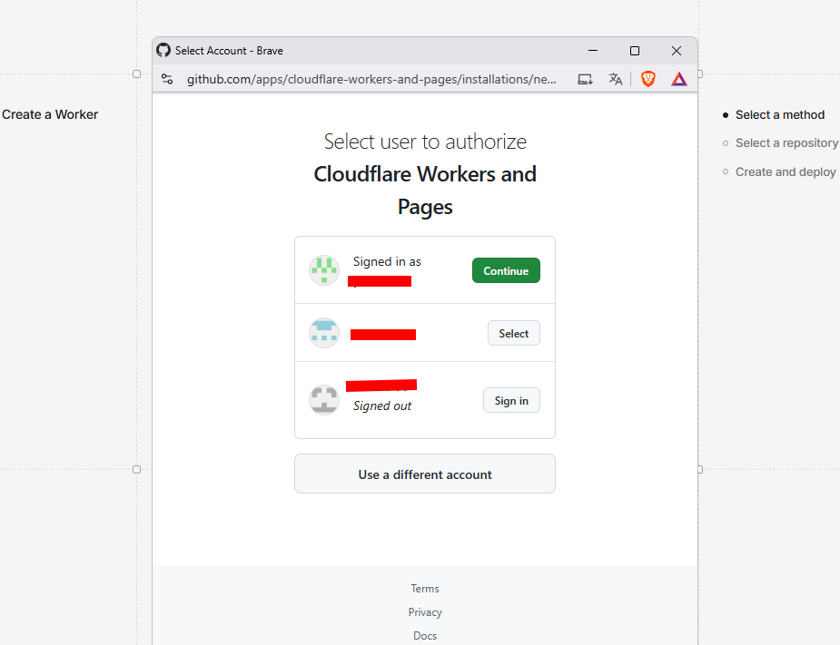

Lo siguiente es clicar en el nombre del Repo y clic en **Next**

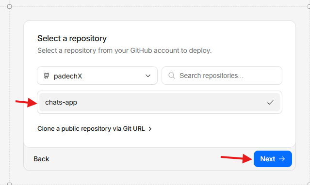

Luego Pulsamos **Advanced settings**, buscamos el campo **Path** y agregamos **/Chat** o el nombre del directorio que contiene los archivos del backend y que tenemos en el repo. Quitamos el check de **Builds for non-production branches**.    
Los demas capos los dejamos como están por defecto.  
El campo **Non-production branch deploy command** lo dejamos vacío. Luego damos clic en **Deploy** y esperamos

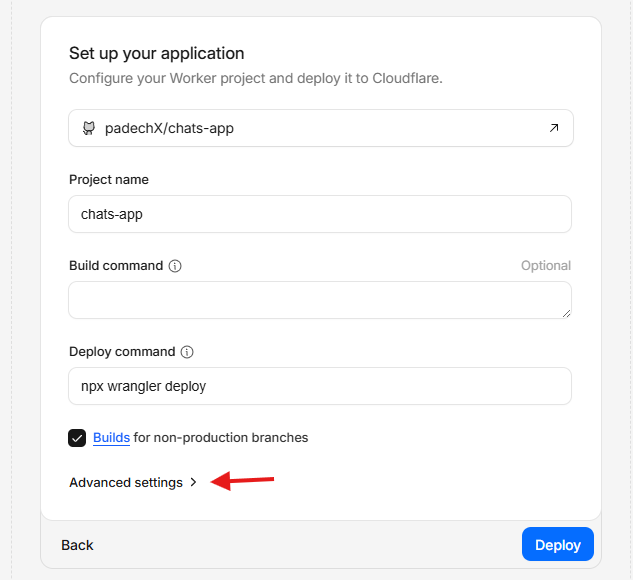 &nbsp; &nbsp; 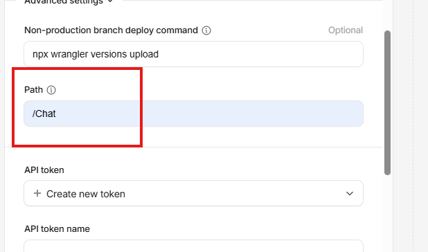 

Se clonará el repositorio y cargarán archivos de **Github** a **Cloudflare**

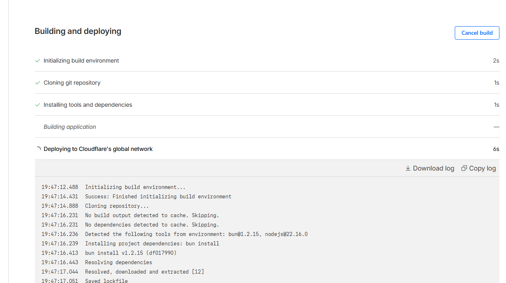

Acontinuacion, Cambia el nombre del **Worker** y pulsa en **Deploy**

  

Luego te lleva de vuelta al **Dashboard/Workers & Pages** y pulsa en **Edit code**

  

Reemplaza el contenido de **Worker** por el contenido del archivo **worker.js** que está en aquí, entre los archivos del repo. Luego pincha en **Save and Deployd**

Vuelve a **Bindings** y pincha en **Add binding**. En el modal que se abre, selecciona **Durable Object** y pulsa **Add Binding**

 &nbsp; &nbsp; 

Luego en **Variable name** ingresa **MESSAGE_QUEUE** y en valor

Luego vuelve al **Dashboard/Workers & Pages** y pulsa en **Settings** Luego en **Variables and Secrets** y despues en **+ Add**

  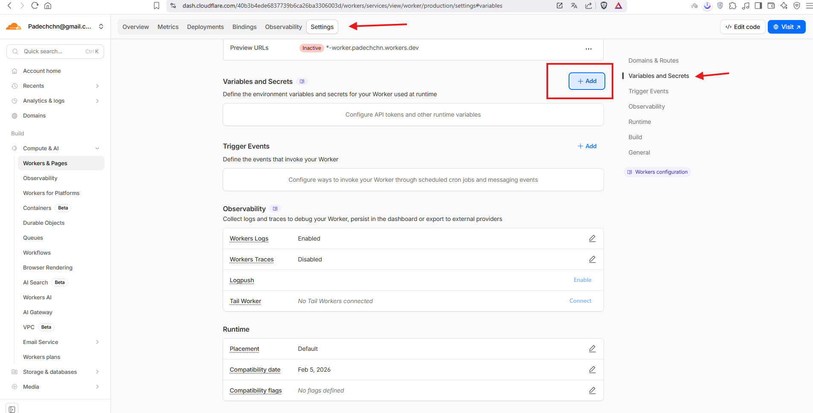

Se abre el desplegable y es donde vas a introducir las **variables de entorno**. Modificamos en **Variable name** y **Value**.

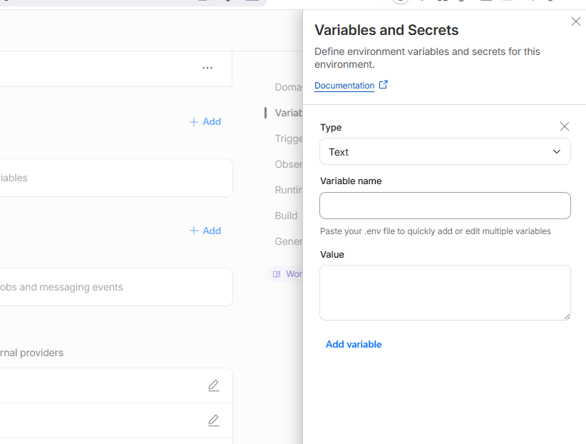

## VARIABLES DE ENTORNO 

- **WHATSAPP_TOKEN**
  - Este token se genera en la plataforma **Meta for Developers**
  Teniendo la "App" creada en **Facebook for Developers** y asignando como caso de uso **Whatsapp**. 
  Es necesario generar un **Token Permanente** para produccion. (Se puede generar uno temporal para pruebas)

  Estando en **Facebook for Developers** Con la app seleccionada, entramos en **Whatsapp/configuracion de la API** y generamos un token temporal. Copiamos ese token temporal y nos vamos a la aprte superior y pulsamos en **Herramientas/Depurador de token de acceso**

 
  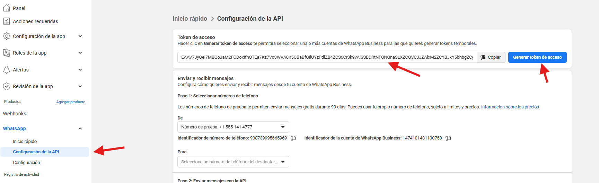 **&nbsp;  &nbsp;** 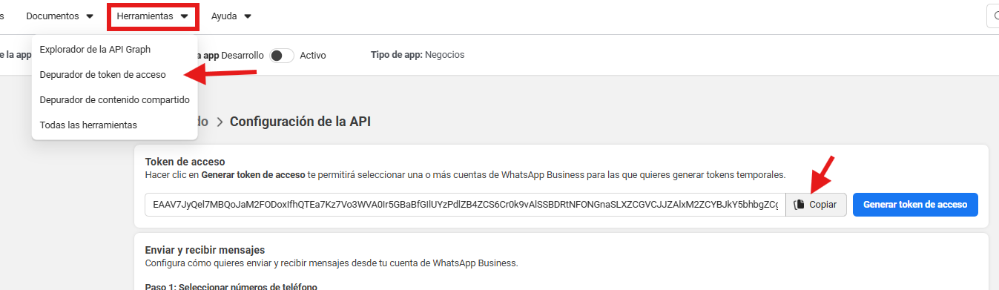
  
En el depurador;

1 - Pegamos el token en el campo vacio.  
2 - Pulsamos en **Depurar**.  
3 - Pulsamos en **Ampliar Token de Acceso**.  
4 - Pulsamos en **Depurar**.  
Con esto conseguimos apliar la duracion del Token de **1Hr** Aprox. a **2 Meses** o mas.
Con este token depurado, crearemos la variable de entorno: **WHATSAPP_TOKEN** en Cloudfare

  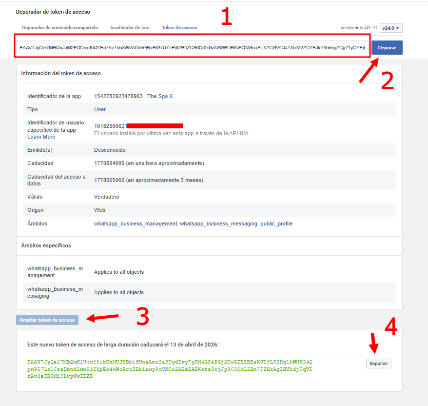 **&nbsp;  &nbsp;** 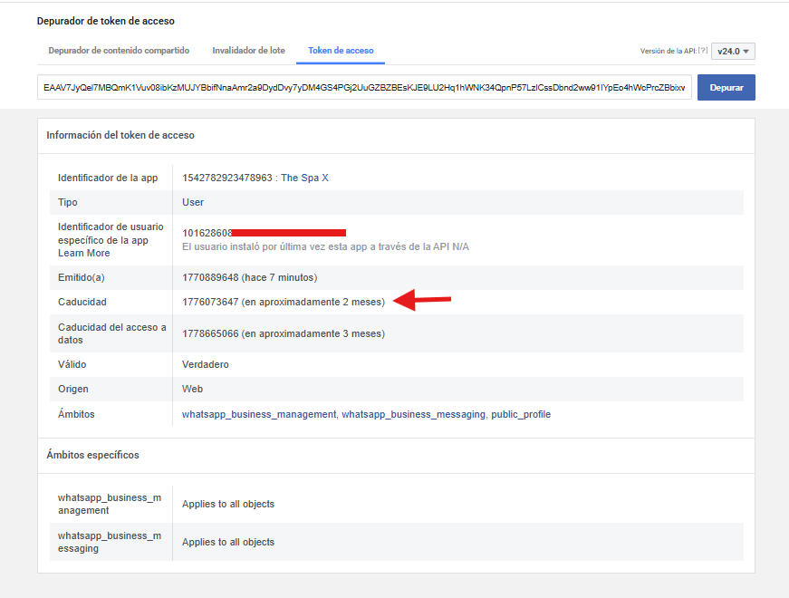
     

  - Para Crear las variables, Estando en **Settings** / **Variables and Secrets**, pulsamos en **+ Add**

  

En el panel que se despliega, agregamos el nombre de la **variable** y **el valor** y pulsamos en **Save Version** para no desplegar automaticamente.

  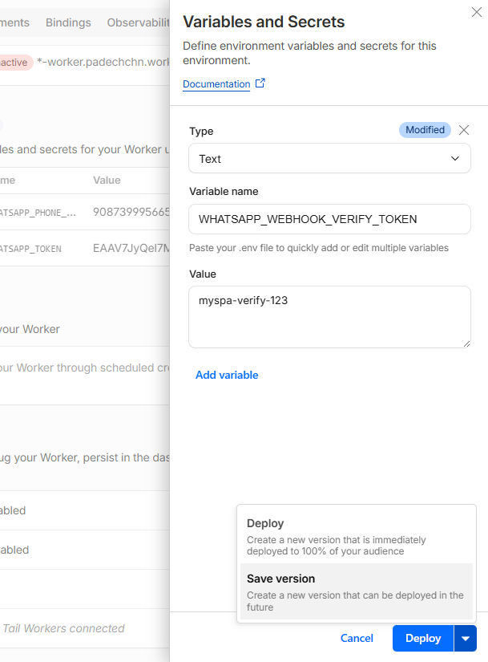

- **WHATSAPP_PHONE_NUMBER_ID**
  - El Phone Number ID de tu número de WhatsApp Cloud. Este se obtiene en la sección de **WhatsApp** / **Configuracion de la API** en Meta for Developers.

  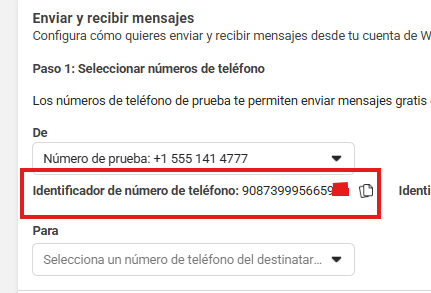
 

______________________________________________________________________________

## Este paso no es necesario pero si RECOMENDABLE
- Hacer un Test de la API y ver que tenemos esto correcto:

 1 - **Generamos un Token Temporal** (Seguimos los pasos, en el video tambien aparecen)

 2 - **Agregamos un numero de telefono real** como destinatario(est no quedará relacionado a la app) es solo para recibir mensajes de prueba

 

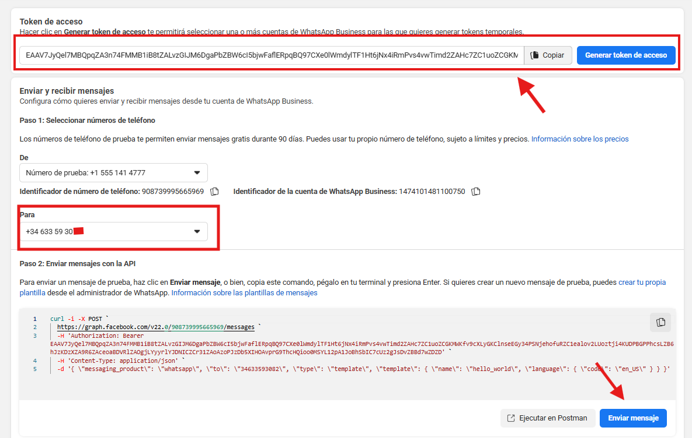
 

 Leegará primero un codigo de verificación y luego, al presionar el boton **Enviar Mensaje**, llegará un mensaje de bienvenida/Exito de la prueba.

 

_____________________________________________________________________________

- **WHATSAPP_WEBHOOK_VERIFY_TOKEN**
  - Un texto cualquiera (tipo `myspa-verify-123`) y el mismo lo pones en Meta cuando configuras el webhook.

Nos dirigimos a **Deployments** en Cloudflare y pulsamos en **Deployd Version**

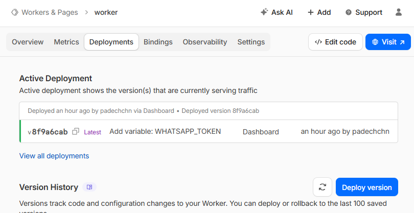

Y pulsamos en **Deployd**

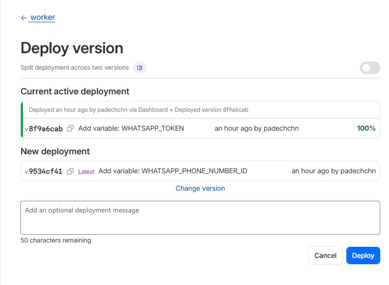

Estando en **Facebook Developers / Meta Developers**, nos dirigimos a **Whatsapp / configuracion**

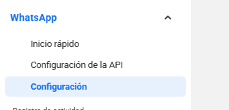

en el panel central, verás la sección de **Webhooks**, donde deberás configurar el webhook.

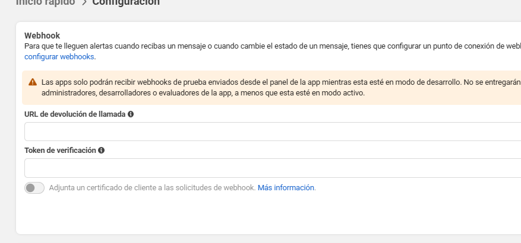

la url que se debe agregar, siendo que la aplicacion esta desplegada en **Cloudflare**, la url seria:

Estando en **Workers & Pages / Overview**, seria la que aparece en el campo **Deployed version** + **/api/whatsapp/webhooks**

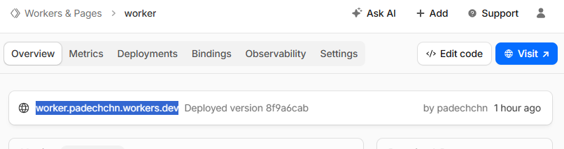

En este ejemplo queda asi: **`https://worker.padechchn.workers.dev/api/whatsapp/webhooks`**

Quedaria en el panel de Facebook Developers de esta forma: 
**Url del Worker** de Cloudflare y en **Verify Token** / **Token de verificacion** el valor de la variable **WHATSAPP_WEBHOOK_VERIFY_TOKEN**

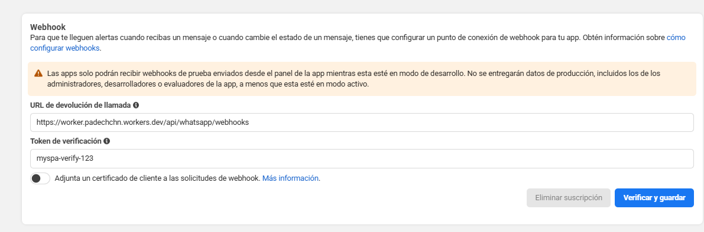

Pulsamos en **Verificar y guardar** y se nos despliegan los **Campos webhook**

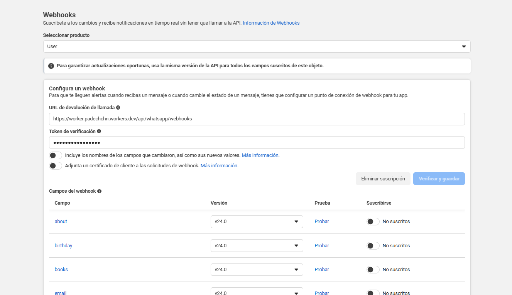

Luego vamos a la seccion **Webhooks**, en el panel central pulsamos en **Seleccionar producto** y en el desplegable seleccionamos **Whatsapp Business Account** (puede ser que el menú varie un poco). Bajamos y buscamos el campo **messages** y lo activamos.

 &nbsp; &nbsp; 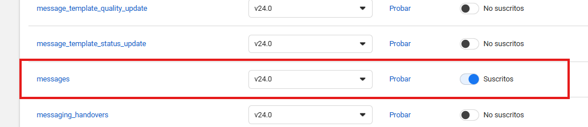

 

- **WHATSAPP_APP_SECRET** (opcional pero recomendado)
  - App Secret de Meta. Si lo pones, el webhook valida la firma `x-hub-signature-256`.
- **WHATSAPP_GRAPH_VERSION** (opcional)
  - Ej: `v24.0`.

________________________________________________________________________________
- Para hacer pruebas con el Token y la conexion final a Whatsapp, se puede usar la aplicacion Postman. Descargable en https://www.postman.com/downloads/ 

